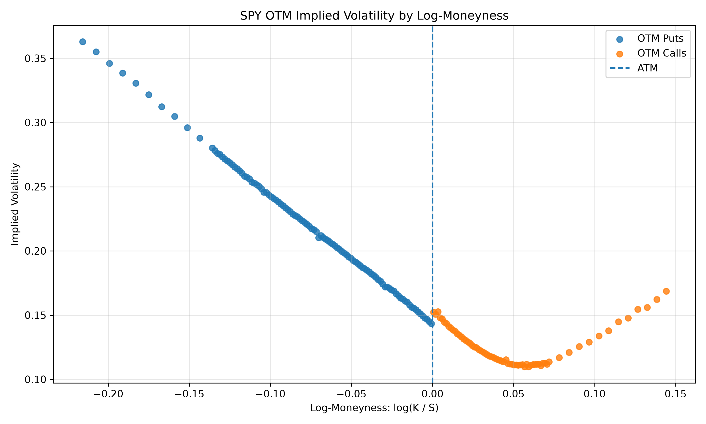
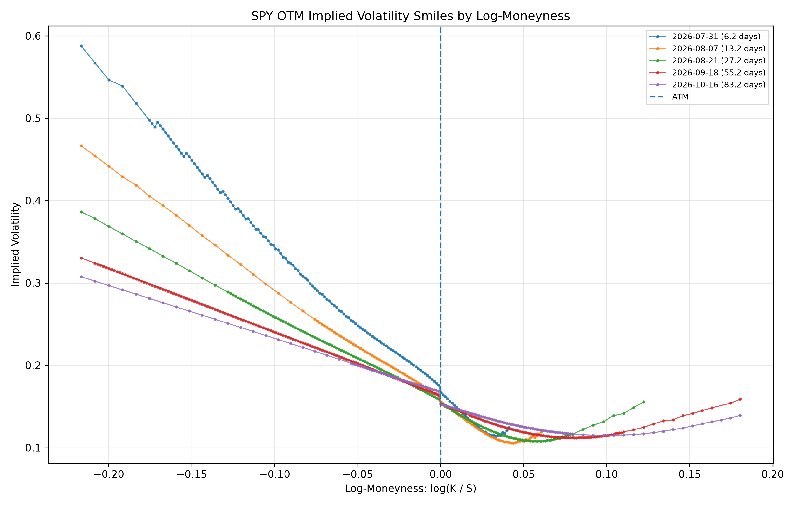
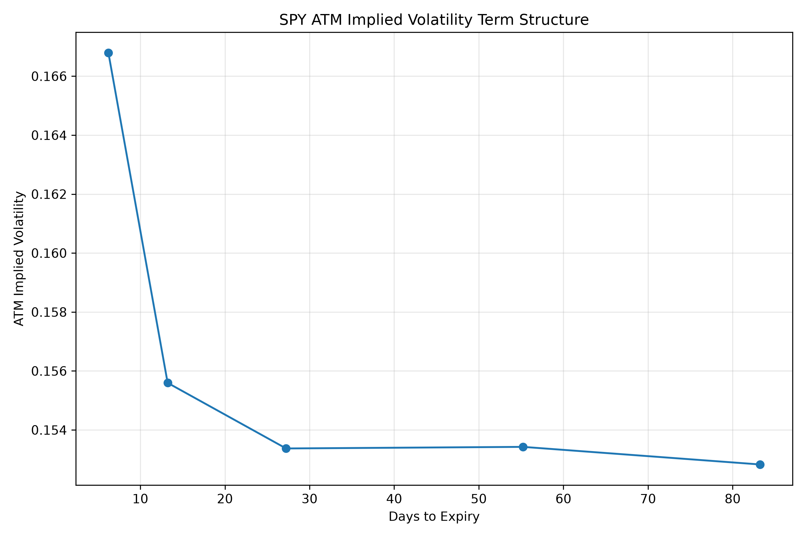
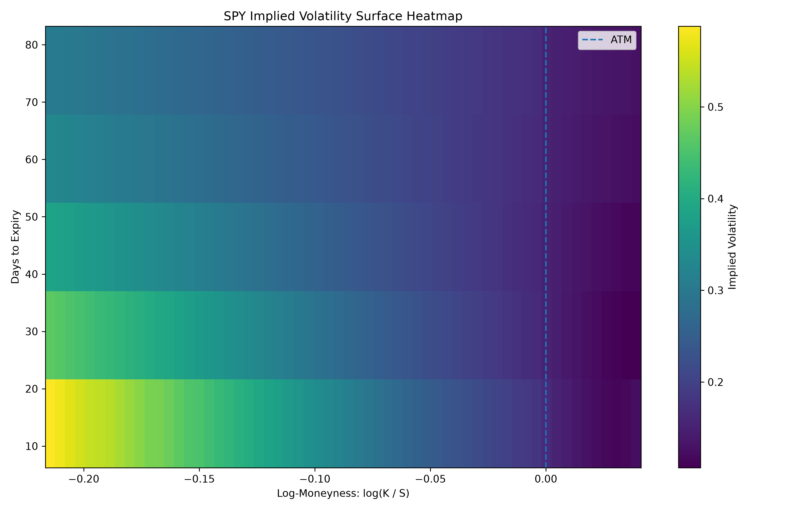
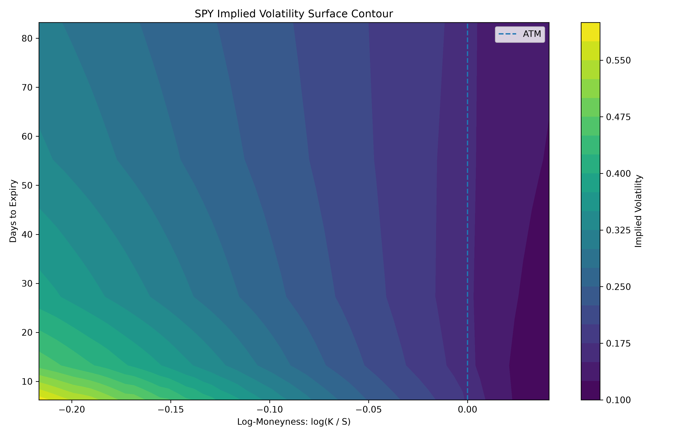
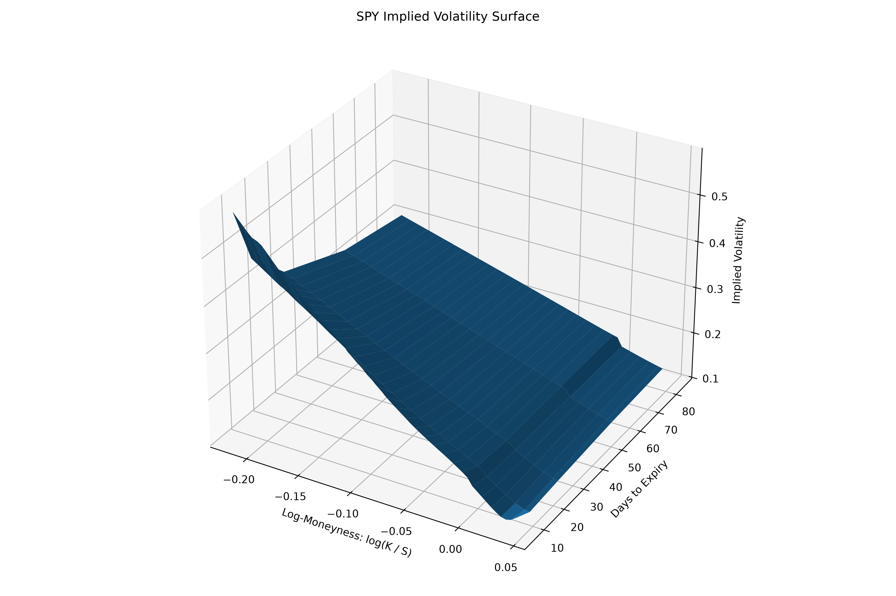
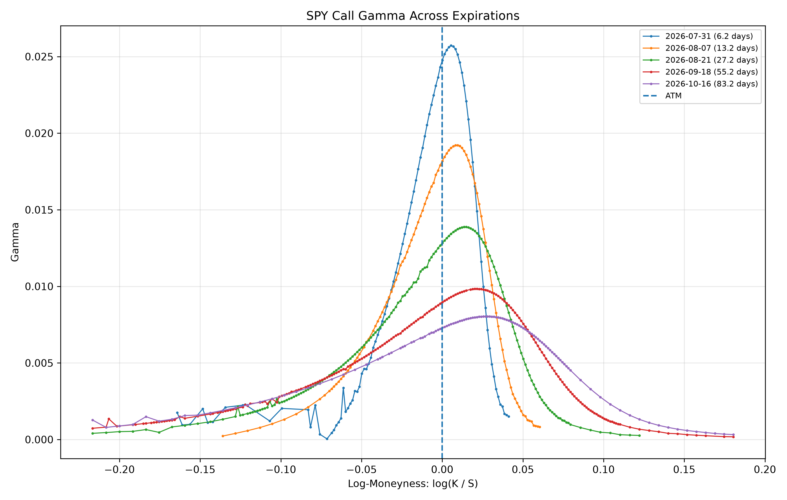
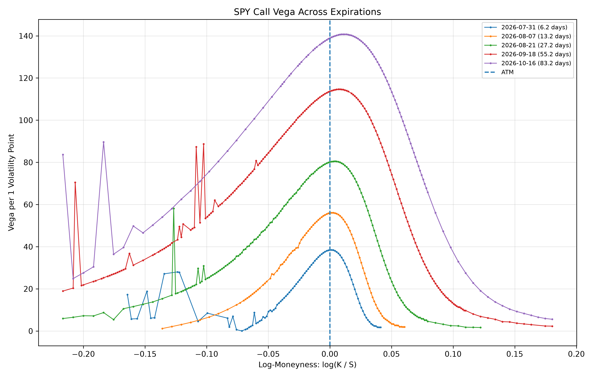

# Options Pricing and Implied Volatility Surface Engine

A Python options analytics project that implements Black–Scholes pricing, option Greeks, implied volatility estimation, real option-chain processing, volatility-smile analysis, and multi-expiry implied volatility surfaces.

The project downloads real SPY option-chain data, filters unreliable market quotes, calculates implied volatility from bid–ask midpoints, selects out-of-the-money options, and constructs a common volatility-surface grid across multiple expirations.

## Project Overview

The project covers the complete workflow from theoretical option pricing to real-market volatility analysis:

1. Implement Black–Scholes call and put pricing.
2. Calculate option Greeks.
3. Recover implied volatility using a bisection solver.
4. Download real SPY option-chain data.
5. Clean bid–ask quotes and remove unreliable observations.
6. Check theoretical option-price bounds.
7. Construct single-expiry volatility smiles.
8. Compare smiles across multiple expirations.
9. Build the ATM volatility term structure.
10. Interpolate market observations onto a common grid.
11. Visualize the implied volatility surface.
12. Run the entire processing pipeline from one command.

## Features

### Black–Scholes Pricing

The engine implements European call and put pricing using:

$begin:math:display$
C \= S N\(d\_1\) \- K e\^\{\-rT\}N\(d\_2\)
$end:math:display$

$begin:math:display$
P \= K e\^\{\-rT\}N\(\-d\_2\) \- S N\(\-d\_1\)
$end:math:display$

where:

$begin:math:display$
d\_1 \=
\\frac\{
\\ln\(S\/K\) \+
\\left\(r\+\\frac\{\\sigma\^2\}\{2\}\\right\)T
\}\{
\\sigma\\sqrt\{T\}
\}
$end:math:display$

$begin:math:display$
d\_2\=d\_1\-\\sigma\\sqrt\{T\}
$end:math:display$

### Greeks

The project calculates:

- Call delta
- Gamma
- Vega
- Call theta
- Call rho

Vega and rho can be reported per one percentage-point change, while theta can be reported per calendar day.

### Implied Volatility Solver

Implied volatility is recovered numerically by solving:

$begin:math:display$
BS\(S\,K\,r\,T\,\\sigma\)
\=
\\text\{market price\}
$end:math:display$

The implementation uses the bisection method and includes validation for:

- Negative market prices
- Unsupported option types
- Prices outside theoretical bounds
- Roots outside the volatility search interval
- Failed numerical convergence

### Real Option-Chain Data

The project downloads SPY option chains using `yfinance`.

Each downloaded row includes metadata such as:

- Option type
- Strike
- Bid and ask
- Last traded price
- Expiration
- Spot price
- Download timestamp
- Volume
- Open interest
- Vendor-provided implied volatility

The download timestamp is stored because option quotes can change significantly depending on whether the market is open and whether the quote snapshot is current.

### Data Cleaning

The cleaning pipeline adds:

$begin:math:display$
\\text\{mid price\}
\=
\\frac\{\\text\{bid\}\+\\text\{ask\}\}\{2\}
$end:math:display$

$begin:math:display$
\\text\{relative spread\}
\=
\\frac\{\\text\{ask\}\-\\text\{bid\}\}\{\\text\{mid price\}\}
$end:math:display$

$begin:math:display$
\\text\{moneyness\}
\=
\\frac\{K\}\{S\}
$end:math:display$

$begin:math:display$
\\text\{log\-moneyness\}
\=
\\log\(K\/S\)
$end:math:display$

It then filters observations using configurable conditions:

- Positive bid
- Positive ask
- Ask greater than or equal to bid
- Positive midpoint
- Maximum relative bid–ask spread
- Minimum and maximum moneyness

The default moneyness interval is:

$begin:math:display$
0\.80 \\leq K\/S \\leq 1\.20
$end:math:display$

### Theoretical Price Bounds

Before solving for implied volatility, market midpoints are checked against European option-price bounds.

For calls:

$begin:math:display$
\\max\(S\-Ke\^\{\-rT\}\,0\)
\\leq C \\leq S
$end:math:display$

For puts:

$begin:math:display$
\\max\(Ke\^\{\-rT\}\-S\,0\)
\\leq P \\leq Ke\^\{\-rT\}
$end:math:display$

Rows outside these bounds are marked invalid and are not passed to the implied-volatility solver.

### OTM Volatility Smile

For each expiration, the project creates a single volatility curve using:

- OTM puts when $begin:math:text$K\<S$end:math:text$
- OTM calls when $begin:math:text$K\\geq S$end:math:text$

OTM options are preferred because their market prices are generally more informative for volatility analysis than deep in-the-money quotes.

### Multi-Expiry Analysis

The downloader selects expirations close to target maturities such as:

- 7 days
- 14 days
- 30 days
- 60 days
- 90 days

The resulting dataset contains short-, medium-, and longer-dated options instead of several nearly identical adjacent expirations.

### ATM Volatility Term Structure

For each expiration, the contract with the smallest absolute log-moneyness is used as an ATM approximation:

$begin:math:display$
\\operatorname\*\{argmin\}
\\left\|
\\log\(K\/S\)
\\right\|
$end:math:display$

The resulting chart shows how ATM implied volatility changes with time to expiry.

### Implied Volatility Surface

Each expiration may contain a different set of strikes. The project therefore interpolates every volatility smile onto a shared log-moneyness grid.

The common interval is restricted to the region supported by every selected expiration. This avoids artificial extrapolation and prevents missing regions in the final surface.

The final surface has:

- Log-moneyness on one axis
- Days to expiry on the second axis
- Implied volatility on the vertical or shading dimension

## Visual Results

### Single-Expiry OTM Volatility Curve



### Multi-Expiry Volatility Smiles



### ATM Volatility Term Structure



### Implied Volatility Heatmap



### Implied Volatility Contour Plot



### Three-Dimensional Volatility Surface



### Gamma Across Expirations



### Vega Across Expirations



## Observations

The analyzed SPY snapshot produced several recognizable option-market patterns.

### Downside Skew

Low-strike OTM puts had higher implied volatility than ATM and OTM call options.

The downside skew was particularly steep for short-dated expirations, indicating that near-term downside protection was relatively expensive in the observed snapshot.

### ATM Term Structure

ATM implied volatility was highest for the shortest expiration and then stabilized around a lower level for medium and longer maturities.

### Gamma

Gamma was concentrated around ATM.

Short-dated options produced taller and narrower gamma peaks, showing that their deltas changed more rapidly in response to small spot-price movements.

### Vega

Vega was largest near ATM and increased with maturity.

Longer-dated options therefore had greater sensitivity to changes in implied volatility.

### Theta

Theta was generally most negative around ATM.

Short-dated options experienced faster time decay, although noisy deep in-the-money quotes occasionally produced unstable implied-volatility and theta estimates.

## End-to-End Pipeline

The complete data-processing workflow can be run with:

```bash
python day18_run_pipeline.py
```

This command:

1. Reads the raw multi-expiry SPY option chain.
2. Adds quote-quality columns.
3. Filters invalid and low-quality quotes.
4. Calculates time to expiry.
5. Checks theoretical price bounds.
6. Solves implied volatility.
7. Selects OTM options.
8. Builds the shared surface grid.
9. Saves processed datasets.

Example output from the current snapshot:

```text
Raw rows: 2142
Rows after cleaning: 1558
Successful IV calculations: 1491
Failed IV calculations: 67
OTM rows: 820
Surface grid shape: 5 x 60
Surface missing values: 0
```

## Project Structure

```text
options-pricing-engine/
│
├── src/
│   ├── arbitrage.py
│   ├── black_scholes.py
│   ├── data_cleaning.py
│   ├── greeks.py
│   ├── implied_volatility.py
│   ├── market_utils.py
│   ├── option_pipeline.py
│   └── time_utils.py
│
├── tests/
│   ├── test_data_cleaning.py
│   ├── test_implied_volatility.py
│   ├── test_option_pipeline.py
│   └── ...
│
├── data/
│   ├── raw/
│   ├── clean/
│   └── processed/
│
├── figures/
│
├── day13_download_multiple_expiries.py
├── day13_process_multiple_expiries.py
├── day14_multi_expiry_smiles.py
├── day15_build_iv_surface_grid.py
├── day16_plot_iv_surface.py
├── day17_real_chain_greeks.py
├── day18_run_pipeline.py
└── README.md
```

## Installation

Create and activate a virtual environment:

```bash
python -m venv .venv
source .venv/bin/activate
```

Install the required packages:

```bash
pip install numpy pandas scipy matplotlib yfinance pytest
```

## Running the Tests

Run the complete test suite with:

```bash
pytest
```

Current result:

```text
64 passed
```

The tests cover areas including:

- Black–Scholes pricing
- Put–call relationships
- Option Greeks
- Implied-volatility recovery
- Invalid market prices
- Option-chain IV calculation
- Quote-quality columns
- Data-cleaning filters
- Theoretical price bounds
- OTM option selection
- Surface-grid construction
- Missing-value prevention

## Running the Analysis

### Download multiple expirations

```bash
python day13_download_multiple_expiries.py
```

### Process the option chains and calculate IV

```bash
python day13_process_multiple_expiries.py
```

### Plot multi-expiry smiles and ATM term structure

```bash
python day14_multi_expiry_smiles.py
```

### Construct the shared volatility grid

```bash
python day15_build_iv_surface_grid.py
```

### Plot the volatility surface

```bash
python day16_plot_iv_surface.py
```

### Calculate real-chain Greeks

```bash
python day17_real_chain_greeks.py
```

### Run the reusable end-to-end pipeline

```bash
python day18_run_pipeline.py
```

## Methodological Choices

### Midpoint Pricing

The bid–ask midpoint is used as the market-price estimate:

$begin:math:display$
M\=\\frac\{\\text\{bid\}\+\\text\{ask\}\}\{2\}
$end:math:display$

This is preferable to relying only on the last traded price, which may be stale.

### OTM Option Selection

OTM puts and calls are combined to form the volatility smile. This reduces reliance on deep in-the-money options, whose quotes may be wider or less synchronized.

### Log-Moneyness

Log-moneyness is used instead of raw strike:

$begin:math:display$
\\log\(K\/S\)
$end:math:display$

This gives a relative measure of strike and makes smiles across different spot levels easier to compare.

### Shared Surface Support

The volatility surface is built only over the log-moneyness interval observed for every expiration.

The engine does not extrapolate beyond the common market support.

### Linear Interpolation

Implied volatility is linearly interpolated between observed market strikes.

This provides a transparent and stable baseline surface without introducing a complex parametric volatility model.

## Limitations

The current implementation intentionally uses several simplifying assumptions:

- European Black–Scholes pricing
- Constant risk-free rate
- No continuous dividend yield
- No early-exercise adjustment
- Linear interpolation across moneyness
- No calendar-arbitrage correction
- No butterfly-arbitrage correction
- Market data obtained from a public data source
- Bid and ask quotes may not be perfectly synchronized
- Deep ITM and very short-dated contracts may contain unstable IV estimates

SPY options are American-style and SPY pays dividends. Therefore, the current model is an approximation, particularly for deep in-the-money contracts.

## Possible Extensions

Future improvements could include:

- Continuous dividend-yield support
- Put Greeks
- American-option pricing
- Binomial-tree pricing
- Newton or Brent implied-volatility solvers
- Live risk-free-rate input
- SVI or SABR smile fitting
- Calendar-arbitrage checks
- Butterfly-arbitrage checks
- Surface smoothing
- Delta-based volatility surfaces
- Interactive Plotly visualizations
- Command-line configuration
- Automated daily market-data snapshots
- Comparison across multiple underlyings

## Disclaimer

This project is intended for educational and research purposes. It is not investment advice and should not be used as a production trading or risk-management system without additional validation.