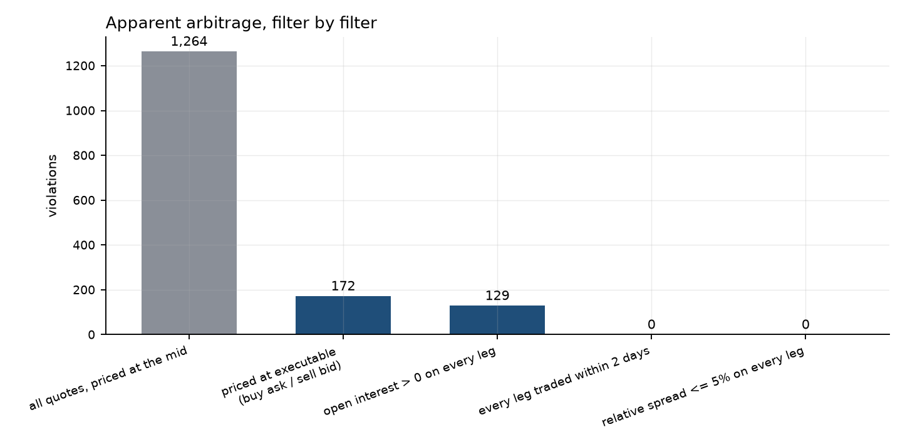
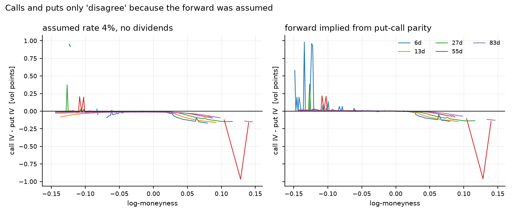

# optlab — a no-arbitrage audit of listed option quotes

**Question.** A public SPY option chain looks like it is full of free money: put-call
parity fails, butterflies price negative, boxes trade below their guaranteed payoff. How
much of that is the market, how much is the modelling convention, and how much is simply
the bid-ask spread?

**Answer, on the snapshot in this repository.** Of **1,264** apparent static-arbitrage
violations at the midpoint, **zero** survive once each leg is priced where a taker could
actually trade and stale quotes are excluded. Every violation that survives execution
prices involves a contract that has not traded in **at least 39.8 days** and sits at
least **10% away from the money**.



| Filter applied | Violations | Total edge |
|---|---:|---:|
| All quotes, priced at the mid | 1,264 | $3,597 |
| Priced at executable (buy the ask, sell the bid) | 172 | $2,919 |
| Open interest > 0 on every leg | 129 | $1,747 |
| **Every leg traded within 2 days** | **0** | **$0** |
| Relative spread ≤ 5% on every leg | 0 | $0 |

Everything below is reproduced from one command; see [Reproducing](#reproducing).

---

## Three findings

### 1. Nearly all "arbitrage" in a retail option chain is the spread, and the rest is dead quotes

The midpoint is not a price you can trade at. Pricing every leg where a taker actually
transacts removes 86% of the violations immediately. Of the remainder, none involves a
live contract: the surviving portfolios are built from quotes a median of **44.9 days**
old on strikes with zero open interest — leftover book entries rather than markets.

The cut is not tuned. Varying the staleness threshold over two orders of magnitude does
not change the answer:

| Max quote age allowed | 0.5d | 1d | 2d | 5d | 10d | 30d | ∞ |
|---|---:|---:|---:|---:|---:|---:|---:|
| Surviving violations | 0 | 0 | 0 | 0 | 0 | 0 | 129 |

### 2. A fifth of the "violations" are manufactured by assuming European exercise

Listed US equity options are American. Early exercise widens the no-arbitrage band: the
floor rises to the immediate exercise value, and — the case that matters most — a *short*
box spread can be assigned early, so it is capped at the undiscounted strike gap
`K₂ − K₁` rather than at `D·(K₂ − K₁)`.

| Bounds convention | Violations at mid | Invented |
|---|---:|---:|
| American (correct for SPY) | 1,264 | — |
| European (textbook screen) | 1,574 | **310 (19.7%)** |

Screening American quotes against European bounds produces 310 violations that the
exercise right fully explains. Run `--exercise-style european` to reproduce.

### 3. Put-call parity identifies the forward, but not the interest rate

Parity says `C − P = D(F − K)`: plot the call-put difference against the strike and you
get a straight line whose intercept gives `D·F` and whose slope gives `−D`. It is tempting
to read both off one regression. The forward comes out clean — the fit has R² > 0.9998 and
a standard error of **under 2 cents** on a $740 forward. The rate does not, because

$$\frac{\partial r}{\partial D} = -\frac{1}{DT},$$

so at one week a slope error of 0.1% becomes a rate error of 5%. On this snapshot the joint
fit returns discount factors **above one** at every maturity — negative interest rates,
which is not a market observation but a measurement failure.

So the library takes the discount factor from the money market, where it is observable to a
basis point, and implies only the forward from the options. The same amplification is why
box spreads cannot pin the rate down either: over six days the interest carried by a $10
box is **$0.007**, against $0.14 of spread across its four legs — twenty times more spread
than signal.

**Consequence for the smile.** A wrong forward pushes call and put implied volatilities in
*opposite* directions, because their deltas have opposite signs. Assuming "4%, no
dividends" misprices the 83-day forward by $2.24 and opens a call/put IV gap that is
entirely an artefact. Implying the forward from parity closes between 9% and 55% of it:



---

## What the library does

```
src/optlab/
├── core/           Black-76 pricing, Greeks, implied volatility, time conventions
├── market/         quote metrics, filtering, the forward curve implied by parity
├── audit/          six static no-arbitrage checks, at mid and executable prices
├── study/          convention error, exercise style, staleness sensitivity
└── report/         figures and the solver benchmark
```

**Priced off the forward, not off a guessed rate.** Every function takes `(F, D)` rather
than `(S, r, q)`, so no risk-free rate or dividend assumption is baked in anywhere.

**The six checks.** Price bounds, monotonicity in strike, vertical spread caps, butterfly
convexity, box spreads, and calendar monotonicity. Each constructs a portfolio whose payoff
is non-negative in every state of the world and asks whether it can be put on for a credit
— no volatility model and no distributional assumption is involved, which is what makes a
violation a fact rather than a disagreement with Black-Scholes.

**Implied volatility.** In-the-money quotes are mapped to their out-of-the-money twin by
parity before inversion, which removes a catastrophic cancellation, and a safeguarded
Newton iteration (`rtsafe`) runs on a shrinking active set. Quotes whose vega is too small
to determine a volatility are reported as `NOT_IDENTIFIED` rather than given a
plausible-looking wrong answer.

| Solver | Max error (vol points) | µs per quote |
|---|---:|---:|
| Safeguarded Newton (this library) | 0 | 4.50 |
| Bisection, tolerance 1e-8 (textbook) | 4.6 × 10⁻⁹ | 4.21 |
| Bisection, matched accuracy (1e-15) | 0 | 7.45 |

At equal accuracy the Newton iteration is 1.65× faster; the first version was *slower*
than bisection until the loop was changed to drop converged quotes instead of running the
whole array until the worst wing option finished.

---

## Reproducing

```bash
pip install -e ".[dev]"
```

```bash
python -m optlab.cli audit data/snapshots/SPY_2026-07-25_multi_expiry.csv
```

That writes every table in this README to `reports/` and every figure to `figures/`. To
capture a fresh chain (needs `pip install ".[data]"`):

```bash
python -m optlab.cli fetch --ticker SPY --target-days 7 14 30 60 90
```

A GitHub Action captures one snapshot after every US close, so the study grows into a panel
rather than resting on a single day.

### Tests

```bash
pytest -q
```

98 tests. The suite is built around a synthetic chain generated from flat-volatility
Black-76 prices, which is arbitrage-free by construction: any violation the audit reports
on it is a bug, and any injected violation it misses is a blind spot. Both directions are
tested for all six checks. Greeks are validated against central finite differences of the
pricer itself, and the property-based tests (Hypothesis) assert parity, monotonicity and
convexity across thousands of random parameter sets.

Two real bugs were found this way and are fixed: the solver silently returned wrong
volatilities for deep in-the-money quotes where vega vanishes, and the checks flagged
floating-point ties as arbitrage.

---

## Honest limitations

- **One snapshot, taken on a Saturday.** Every quote is a Friday-close leftover, which is
  the worst case for staleness and almost certainly inflates the mid-price violation count.
  The daily snapshot job exists to fix this; until it has run for a while, treat the
  headline as one day's evidence.
- **The vendor's spot may not be synchronous with the option quotes.** The implied dividend
  yield wanders between 1.0% and 2.5% across maturities, against a true SPY yield near
  1.2%; most of that spread is asynchronous sampling, not dividend expectations.
- **Quotes are not the book.** Displayed size is unknown, so "executable" means executable
  for one contract at the touch, ignoring depth and fees.
- **No early-exercise model.** American bounds are handled exactly, but no binomial or
  Bjerksund-Stensland price is computed, so implied volatilities inherit a small
  early-exercise bias for deep in-the-money contracts.
- **Call-side quotes are wider than put-side quotes** by 1.1× to 4.7× near the money in
  this snapshot. Any parity-based estimate inherits that asymmetry.

## What I would do next

1. Run the audit across the accumulating snapshot panel and report violation rates per day
   rather than per snapshot.
2. Add a Bjerksund-Stensland American pricer so implied volatilities are exercise-consistent
   deep in the money.
3. Compare a paid, timestamped quote feed against this vendor snapshot to separate genuine
   microstructure from data artefacts.

## References

The relations tested here are standard; the framing follows Merton (1973) for the rational
bounds, and the treatment of executable versus mid pricing follows the market-microstructure
convention that an apparent arbitrage inside the spread is not one.

## License

MIT.
